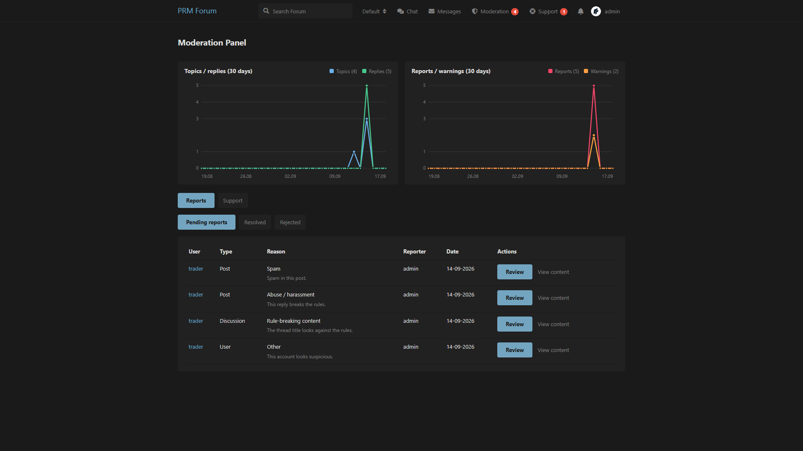
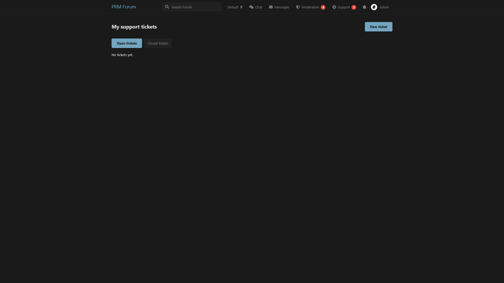

# Moderator Panel

Staff tools for reports, warnings, bans, and support tickets.

Compatible with **Flarum 1.8**.

## Screenshots

Moderation panel:



User tickets:



## What it does

- Members can **report** users, posts, and discussions
- Staff open a **Moderation** panel with pending / resolved / rejected reports
- Charts for topics, replies, reports, and warnings (last 30 days)
- Staff can **warn**, hide content, or **ban** while handling a report
- Users open **support tickets**; staff answer them from the panel
- Ticket statuses: new, waiting, answered, closed

## Install

```bash
composer config repositories.prm-moderation vcs https://github.com/smmpanelscripts1/prm-moderation
composer require prm/moderation:dev-main
```

Enable **Moderator Panel**, then:

```bash
php flarum migrate
php flarum cache:clear
```

## How to use

### Permissions (Admin → Permissions)

| Permission | Who |
| --- | --- |
| Access moderation panel | Staff |
| Report user / topic / post | Members |
| Open a support ticket | Members |

### Reports

Use **Report** on a user, post, or discussion. Staff see them under **Moderation → Reports**.

### Tickets

Users: header **Support** → **New ticket**.  
Staff: **Moderation → Support**, or the same Support link.

## License

MIT
